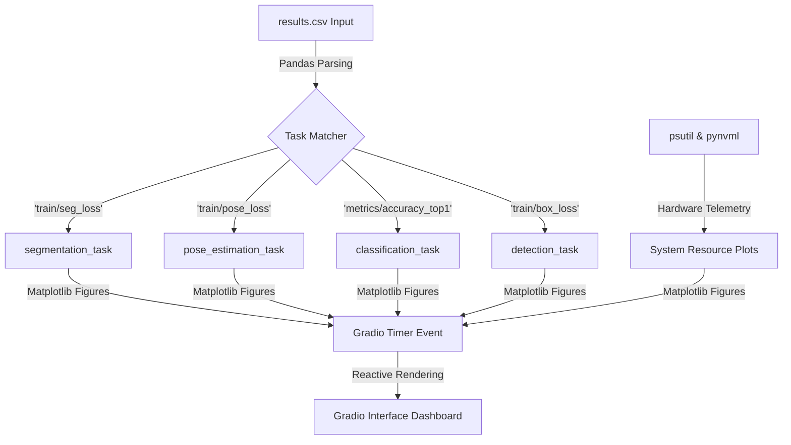

# YOLO-Training-Visualizer

<div align="center">

### **A real-time, interactive logging board tailored for parsing YOLO training logs (`results.csv`) and rendering advanced computer vision metrics.**

[](https://www.python.org)
[](https://gradio.app)
[](https://github.com/ultralytics/ultralytics)
[](LICENSE)

⭐ **Star this repo if it helps you!** ⭐

🔥 **Share it with the community!** 🔥

[](https://x.com/intent/tweet?text=Check%20out%20this%20amazing%20AI%20Image%20Classification%20project!%20🤖✨%20https://github.com/Mushrum-mmb/Simple-AI-Image-Classification%20%23AI%20%23MachineLearning%20%23DeepLearning)
[](https://www.facebook.com/sharer/sharer.php?u=https://github.com/Mushrum-mmb/Simple-AI-Image-Classification)
[](https://www.linkedin.com/sharing/share-offsite/?url=https://github.com/Mushrum-mmb/Simple-AI-Image-Classification)
[](https://www.reddit.com/submit?title=Amazing%20AI%20Image%20Classification%20Project&url=https://github.com/Mushrum-mmb/Simple-AI-Image-Classification)

</div>

---

## 📋 Table of Contents

- [About](#-about)
- [Features](#-features)
- [Gallery](#-gallery)
- [Local Usage](#%EF%B8%8F-local-usage)
- [Google Colab Usage](#-google-colab-usage)
- [How It Works](#-how-it-works)
- [Contributing](#-contributing)
- [License](#-license)


## 🚀 About

<div align="center">

**YOLO Training Visualizer** is a lightweight, intuitive visualization tool built on top of **Gradio**. This application allows computer vision engineers and developers to seamlessly upload their `results.csv` log files (generated during Ultralytics YOLO model training) to analyze, compare, and monitor essential performance metrics interactively in real time.

</div>

<div align="center">

| **Interface** | **Framework** | **Author** |
|:---:|:---:|:---:|
| Web_based | Gradio | [Mushrum-mmb](https://github.com/Mushrum-mmb/) |

</div>

### 🌟 **Key Highlights:**
- **Flexible File Upload**: Supports dragging and dropping or directly browsing to upload your `results.csv` file.
- **Real-time Graphs**: Automatically parses data and renders responsive, interactive charts.
- **Comprehensive Metric Tracking**:
  - **Loss Metrics**: Box Loss, Cls Loss, DFL Loss (for both Train and Validation sets).
  - **Performance Metrics**: Precision (B), Recall (B), mAP50 (B), mAP50-95 (B).
- **User-friendly Interface**: Clean, modern UI with built-in support for Gradio's automatic light/dark mode toggling.
---

## 📸 Gallery

<div align="center">
    
### 🔍 **See the Magic in Action!**

*Examples of successful classify training visualization*
<div align="center">


</div>

*Detection Training*
<div align="center">


</div>

*Pose Estimation*

<div align="center">


   
</div>

*Segmentation*

</div>


</div>

---

## ✨ Features

<div align="center">

### **What Makes This Special?**

</div>

| Feature | Description | Benefit |
|---------|-------------|---------|
| **Real-time Parsing** | Extracts live training metrics from Ultralytics `results.csv` files | Instant insights without reading raw data |
| **Comprehensive Charts** | Visualizes both complex Loss functions and Performance metrics | Clear oversight of model convergence |
| **Instant Inference** | Dynamic graph rendering immediately upon file upload | No lag, smooth user experience |
| **Gradio Web UI** |Modern, reactive web interface accessible directly via browser | No complex GUI dependencies required |
| **Easy Deployment** | Launches with a single command and supports public link sharing | Seamless collaboration and quick previews |
| **Zero Setup Overheads** | Lightweight implementation running purely on the CPU/GPU local backend | Works on any device without heavy deep learning environments |

<div align="center">

### 🎯 **Perfect For:**
**Students** • **Researchers** • **Developers** 

</div>

---

## ▶️ Local Usage

<div align="center">

### 🚀 **Launch this App in 4 Simple Steps!**

</div>

**Step 1:** Clone the repository
```bash
git clone https://github.com/Mushrum-mmb/YOLO-Training-Visualizer.git
```

**Step 2:** Navigate to project directory
```bash
cd YOLO-Training-Visualizer
```

**Step 3:** Install the requirements
```bash
pip install -r requirements.txt
```

**Step 4:** Launch the application
```bash
python app.py
```

<div align="center">
    
*🎉 Your App is Ready! Open the provided link in your browser and start visualizing trainings!*

</div>


---

## 💻 Google Colab Usage

<div align="center">

### ☁️ **Perfect for Potato Computers!** 🥔

[](https://colab.research.google.com/drive/1BF0_3p7gzR7V3YiGQX97JrS4q769pErK?usp=sharing)

</div>

Can't run AI on your device? No problem! Use our optimized Google Colab notebook for seamless cloud-based AI training and inference.

<details>
<summary>📖 <strong>Colab Guide (Click to expand)</strong></summary>

*Just execute the first and second cell*


**Launch and enjoy! 🎉**

</details>

---

## 🔧 How It Works

<div align="center">

### **Architecture Overview**

</div>

Our real-time logging board processes CSV telemetry and hardware data through a centralized pipeline:

<div align="center">



</div>

| Component | Purpose | Key Features |
|-----------|---------|-------------|
| **Task Matcher** | Log Classification | • Automatically detects YOLO task types from CSV headers.<br>• Routes logs to matching analysis tracks. |
| **Task Functions** | Metric Processing | • Evaluates training/validation metrics and learning rates.<br>• Computes best scores using a colored threshold picker. |
| **Resource Monitors** | Hardware Telemetry | • Tracks rolling CPU, RAM, and Disk metrics via `psutil`.<br>• Hooks into NVIDIA VRAM logs via `pynvml`. |
| **App Interface** | Dashboard Loop | • Drives seamless page-switching inside a terminal theme.<br>• Uses `gr.Timer` to stream data updates without reloading. |

---

## 🤝 Contributing

<div align="center">

### 💡 **Help Make This Project Even Better!**

[](https://github.com/Mushrum-mmb/Simple-AI-Image-Classification/issues)

</div>

We love contributions from the community! Here's how you can help:

- **Report bugs** or suggest features
- **Submit pull requests** with improvements
- **Improve documentation** and tutorials
- **Share your results** and use cases
- **Star the repo** to show support!

---

## 📜 License

<div align="center">

[](https://opensource.org/licenses/MIT)

This project is licensed under the **MIT License** - see the [LICENSE](LICENSE) file for details.

</div>
